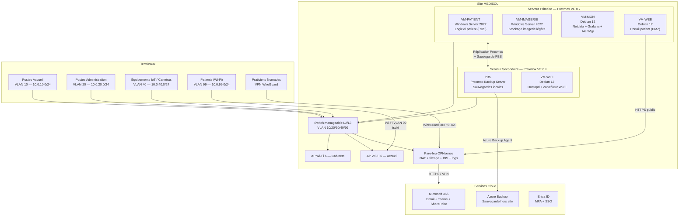

# 02 — Architecture proposée

## 2.1 Principes directeurs

L'architecture retenue repose sur cinq axes :

1. **Élimination du SPOF** — deux serveurs physiques avec réplication automatique des VMs
2. **Virtualisation type 1** — Proxmox VE sur bare-metal, isolation des services critiques en VMs dédiées
3. **Segmentation réseau stricte** — VLANs par zone fonctionnelle, pare-feu OPNsense inter-zones
4. **Wi-Fi managé** — contrôleur Wi-Fi logiciel avec SSIDs distincts, QoS et isolation des patients
5. **Conformité RGPD** — chiffrement au repos et en transit, journalisation des accès aux données patients

---

## 2.2 Vue d'ensemble de l'architecture cible



---

## 2.3 Plan d'adressage et VLANs

| VLAN | Nom | Plage IP | Accès autorisé | Accès interdit |
|---|---|---|---|---|
| **VLAN 10** | Métier accueil | 10.0.10.0/24 | VM-PATIENT, imprimantes | Internet direct, VLAN 99 |
| **VLAN 20** | Administration | 10.0.20.0/24 | VM-IMAGERIE, M365, imprimantes | VLAN 99, VLAN 40 |
| **VLAN 30** | Serveurs | 10.0.30.0/24 | VMs internes uniquement | Tout accès direct externe |
| **VLAN 40** | IoT / Caméras | 10.0.40.0/24 | NVR local uniquement | Tous les autres VLANs |
| **VLAN 99** | Invités / Patients | 10.0.99.0/24 | Internet uniquement | Tous les VLANs internes |

---

## 2.4 Composants de l'architecture

### Serveurs physiques

| Composant | Spécification recommandée |
|---|---|
| SRV1 (primaire) | Dell PowerEdge R350 — 2x Xeon Silver, 64 GB RAM, 2x 1 TB NVMe + 4x 4 TB SAS |
| SRV2 (secondaire) | Dell PowerEdge R350 — identique à SRV1 |
| Stockage ZFS | RAID Z1 sur SRV1 et SRV2 — réplication ZFS bidirectionnelle |

### Machines virtuelles

| VM | Rôle | OS | vCPU | RAM | Stockage |
|---|---|---|---|---|---|
| VM-PATIENT | Logiciel patient (RDS Remote App) | Windows Server 2022 | 8 | 16 GB | 150 GB |
| VM-IMAGERIE | Stockage imagerie légère (SMB + DFS) | Windows Server 2022 | 4 | 8 GB | 2 TB |
| VM-MON | Supervision (Netdata + Grafana) | Debian 12 | 2 | 4 GB | 100 GB |
| VM-WEB | Portail patient (Nginx + app) | Debian 12 | 2 | 4 GB | 50 GB |
| VM-WIFI | Contrôleur Wi-Fi (hostapd / OpenWRT) | Debian 12 | 2 | 2 GB | 20 GB |
| PBS | Proxmox Backup Server | PBS OS | 4 | 8 GB | 4 TB |

### Réseau

- **Pare-feu** : OPNsense (VM dédiée ou appliance) — routage inter-VLAN contrôlé, IDS Suricata, logs RGPD
- **Switch** : Switch manageable L2/L3 24 ports PoE (Cisco CBS350 ou HP Aruba 1960)
- **Wi-Fi** : 2x Access Points Wi-Fi 6 (Ubiquiti UniFi U6-Pro ou équivalent)
  - SSID `MEDISOL-Praticiens` → VLAN 10
  - SSID `MEDISOL-Admin` → VLAN 20
  - SSID `MEDISOL-Patients` → VLAN 99 (isolé, portail captif)

---

## 2.5 Politique de sécurité réseau (OPNsense)

```
Règles inter-VLAN (extrait) :

VLAN 10 (Accueil)     → VLAN 30 (Serveurs) : TCP 445, 3389 AUTORISÉ (SMB, RDS)
VLAN 10 (Accueil)     → VLAN 99 (Patients)  : REFUSÉ
VLAN 20 (Admin)       → VLAN 30 (Serveurs) : TCP 445, HTTPS AUTORISÉ
VLAN 20 (Admin)       → VLAN 99 (Patients)  : REFUSÉ
VLAN 40 (IoT)         → Tous                : REFUSÉ (sauf NVR local)
VLAN 99 (Patients)    → Tous sauf Internet  : REFUSÉ
WireGuard VPN         → VLAN 10 uniquement  : AUTORISÉ (praticiens nomades)
```

---

## 2.6 Haute disponibilité et réplication

- **Proxmox HA Manager** : bascule automatique des VMs critiques (VM-PATIENT, VM-IMAGERIE) en cas de panne nœud
- **ZFS Replication** : réplication synchrone des datastores entre SRV1 et SRV2 (toutes les 15 min)
- **PBS** : sauvegardes nightly 23h00, rétention 30 jours
- **Azure Backup** : sauvegarde 2x/semaine, rétention 12 mois

---

## 2.7 Accès nomades — praticiens itinérants

```
Praticien (domicile / cabinet secondaire)
    │
    └─[WireGuard VPN]──► OPNsense (SRV1 port 51820)
                              │
                              └──► VLAN 10
                                    │
                                    └──► VM-PATIENT (RDS RemoteApp)
                                         └──► Logiciel patient
```

- Authentification : certificat WireGuard + MFA Entra ID (Authenticator)
- Accès limité à VM-PATIENT uniquement (VLAN 10, port TCP 3389)
- Aucun accès aux VLANs Admin, IoT ou Serveurs

---

## 2.8 Portail patient — DMZ

Le portail patient (en développement) est hébergé dans **VM-WEB** (VLAN 30, sous-zone DMZ) :

```
Internet ──► OPNsense (HTTPS 443) ──► VM-WEB (Nginx reverse proxy)
                                         │
                                         └──► Application portail patient
                                              └──► Base de données chiffrée
```

- Flux sortant limité : VM-WEB ne peut pas accéder aux VLANs 10/20/40
- Certificat TLS automatique (Let's Encrypt via OPNsense ACME)
- WAF OPNsense Nginx pour protection des applications web
